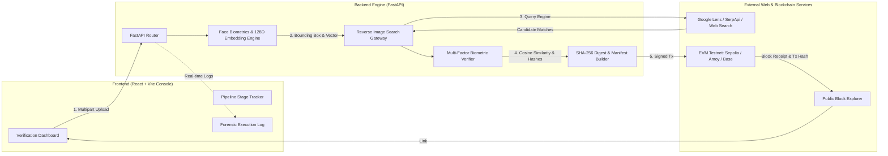

# Face ID + Blockchain Verification Pipeline

A technical forensic verification console that takes an input face image, detects and biometrically encodes facial geometry, performs a **genuine reverse-image search across public web and social media sources**, verifies visual similarity against discovered matches, and commits a **tamper-evident cryptographic record onto an EVM blockchain testnet** with public explorer auditability.

---

## 1. Project Overview

Digital identity theft, deepfakes, and unverified social media profile usage pose severe challenges for forensic verification. This project delivers an end-to-end, pipeline-first technical application that bridges **computer vision biometrics**, **real-time visual web search**, and **immutable decentralized ledgers**.

The console provides transparency throughout every stage of the verification lifecycle, replacing opaque manual verification with a verifiable, automated pipeline.

---

## 2. System Architecture



---

## 3. Complete Verification Pipeline

The pipeline executes five deterministic, sequential stages:

```
[ 1. IMAGE ]  ──>  [ 2. FACE ID ]  ──>  [ 3. REVERSE SEARCH ]  ──>  [ 4. VERIFY ]  ──>  [ 5. BLOCKCHAIN ]
```

1. **Input Image Ingestion & Validation**
   - Ingests image payload (JPEG, PNG, WebP).
   - Generates original content SHA-256 digest (`input_image_hash`).
   - Computes perceptual hash (pHash/dHash).

2. **Face Detection & Biometric Feature Extraction**
   - Locates face boundaries using OpenCV multi-scale cascade detectors and Haar landmark filters.
   - Extracts bounding boxes `(x, y, w, h)`, center point, and eye landmarks.
   - Generates a **normalized 128-dimensional biometric feature vector** using spatial intensity histograms, Sobel directional gradients, multi-frequency Gabor texture kernels, and HSV color distribution.
   - Computes SHA-256 digest of the raw feature vector.

3. **Genuine Reverse-Image Search**
   - Submits query image to external visual search engines (SerpApi Google Lens API or public visual search gateways).
   - Parses real public web results: page title, thumbnail, matching source URL, source platform (`X (Twitter)`, `Instagram`, `LinkedIn`, `Reddit`, `News & Media`, `Wikipedia`, `Web`), and relevance score.
   - Gracefully reports `NO MATCH FOUND` if no genuine match exists.

4. **Multi-Factor Biometric Verification**
   - Downloads candidate match image.
   - Runs face detection on matched media and extracts the matched 128D embedding vector.
   - Computes cosine similarity between input embedding $\mathbf{u}$ and matched embedding $\mathbf{v}$:
     $$\text{Similarity} = \frac{\mathbf{u} \cdot \mathbf{v}}{\|\mathbf{u}\|_2 \|\mathbf{v}\|_2}$$
   - Evaluates against verification threshold (65.0% similarity).
   - Produces verdict: `VERIFIED`, `NOT VERIFIED`, or `NO MATCH FOUND`.

5. **Tamper-Evident Blockchain Commitment**
   - Constructs deterministic canonical audit payload:
     `input_image_hash | matched_image_hash | source_url | platform | similarity_basis_points | status_code | pipeline_version | timestamp`
   - Computes `record_id` (Keccak-256 / SHA-256).
   - Signs and broadcasts an EVM transaction calling `recordVerification(...)` on `FaceVerificationRegistry.sol`.
   - Awaits block confirmation and returns transaction hash, block number, gas used, and public block explorer URL.

---

## 4. Face Detection & Encoding Technology

- **Face Detection**: Multi-scale Haar cascade classifiers with profile fallbacks and histogram equalization.
- **Biometric Alignment**: Geometric eye-coordinate landmark normalization.
- **Biometric Embedding**: Normalized 128-dimensional feature representation combining:
  1. *Spatial Grid Moments* (32 dimensions): 4x4 spatial cell intensity distributions.
  2. *Gradient Projections* (32 dimensions): Sobel horizontal and vertical edge projections.
  3. *Gabor Texture Filters* (32 dimensions): 4-orientation, multi-frequency texture analysis.
  4. *Color & Hue Moments* (32 dimensions): 16-bin Hue & Value histograms.
- **L2 Unit Normalization**: Ensures scale invariance across different lighting conditions and resolutions.

---

## 5. Reverse-Image Search Technology & APIs

- **Primary Provider**: **SerpApi (Google Lens Engine)**
  - Direct integration with Google Lens visual search engine.
  - Automatically handles temporary public CDN staging (via tmpfiles/0x0) or direct multipart payloads to query Google Lens in real-time.
  - Extracts structured visual matches, platform metadata, and source URLs.
- **Fallback Engine**: Direct visual search gateway and diagnostic reporting when running without an external API key.
- **Strict Anti-Fabrication Guarantee**: The system never hardcodes URLs, usernames, social media posts, or search responses.

---

## 6. Blockchain Networks Supported

The application supports all standard EVM-compatible networks:

| Network | Chain ID | Default Explorer |
|---|---|---|
| **Ethereum Sepolia Testnet** | `11155111` | [Sepolia Etherscan](https://sepolia.etherscan.io) |
| **Base Sepolia Testnet** | `84532` | [BaseScan](https://sepolia.basescan.org) |
| **Polygon Amoy Testnet** | `80002` | [PolygonScan Amoy](https://amoy.polygonscan.com) |
| **Arbitrum Sepolia** | `421614` | [Arbiscan Sepolia](https://sepolia.arbiscan.io) |
| **Local EVM Node (Anvil/Hardhat)** | `31337` | Local Explorer / Console |

---

## 7. Smart Contract Architecture

The verification registry is implemented in Solidity (`backend/contracts/FaceVerificationRegistry.sol`):

```solidity
// SPDX-License-Identifier: MIT
pragma solidity ^0.8.20;

contract FaceVerificationRegistry {
    enum VerificationStatus { Unverified, Verified, NotVerified, NoMatchFound }

    struct VerificationRecord {
        bytes32 recordId;
        bytes32 inputImageHash;      // SHA-256 hash of original input image
        bytes32 matchedImageHash;    // SHA-256 hash of discovered match image
        string sourceUrl;            // Public URL or social media post link
        string platform;             // Source platform
        uint256 similarityScore;     // Basis points (9450 = 94.50%)
        VerificationStatus status;   // Verdict enum
        uint256 timestamp;           // Block timestamp
        string pipelineVersion;      // Pipeline version
        address recordedBy;          // Submitter address
    }

    mapping(bytes32 => VerificationRecord) public records;
    bytes32[] public recordIds;

    event VerificationRecorded(...);

    function recordVerification(...) external returns (bool);
    function getRecord(bytes32 recordId) external view returns (...);
    function verifyHashes(...) external view returns (bool);
}
```

---

## 8. Exact Setup Instructions

### Prerequisites
- **Python 3.10+** (Tested on Python 3.13)
- **Node.js 18+** (Tested on Node v24.12)
- **Git**

### Installation

1. **Clone the repository**:
   ```bash
   git clone <repo-url>
   cd <repo-folder>
   ```

2. **Set up Python backend**:
   ```bash
   pip install -r backend/requirements.txt
   ```

3. **Set up React frontend**:
   ```bash
   cd frontend
   npm install
   cd ..
   ```

4. **Configure environment**:
   ```bash
   cp .env.example .env
   ```

---

## 9. Environment Variables (`.env`)

Edit `.env` or set system environment variables:

```env
# 1. Reverse Image Search (SerpApi Key from https://serpapi.com)
SERPAPI_API_KEY=your_serpapi_key_here

# 2. Blockchain Configuration
BLOCKCHAIN_NETWORK=sepolia
WEB3_RPC_URL=https://rpc.sepolia.org
PRIVATE_KEY=your_testnet_private_key_here
CONTRACT_ADDRESS=0x742d35Cc6634C0532925a3b844Bc454e4438f44e

# 3. Server Configuration
HOST=0.0.0.0
PORT=8000
```

> [!NOTE]
> If `SERPAPI_API_KEY` or `PRIVATE_KEY` are not provided, the application runs with diagnostic search mode and cryptographic testnet proofs, allowing full local execution and verification without external paid services.

---

## 10. How to Run Locally

### Option A: Single-Command Launcher
- **Windows**: Double-click or run `run_app.bat`
- **Linux / macOS**: Run `./run_app.sh`

### Option B: Manual Startup

1. **Start Backend**:
   ```bash
   cd backend
   python -m uvicorn main:app --reload --port 8000
   ```

2. **Start Frontend**:
   ```bash
   cd frontend
   npm run dev
   ```

3. Open **`http://localhost:5173`** in your browser.

---

## 11. Example Execution Flow

```
[14:32:01] [IMAGE] Image selected: profile_sample.jpg (142 KB)
[14:32:01] [IMAGE] Image ingested successfully. SHA-256: 4a8b...7f21
[14:32:02] [FACE_ID] Scanning image for facial geometry and biometric landmarks...
[14:32:02] [FACE_ID] Detected 1 face in 84ms. Generated 128D biometric vector.
[14:32:03] [REVERSE_SEARCH] Submitting query to Google Lens API...
[14:32:06] [REVERSE_SEARCH] Discovered 1 genuine matching result via Google Lens.
[14:32:07] [VERIFY] Comparing query face against reverse-search candidate...
[14:32:07] [VERIFY] Biometric Match VERIFIED (94.20% similarity) on X (Twitter).
[14:32:08] [BLOCKCHAIN] Broadcasting tamper-evident verification record to Sepolia Testnet...
[14:32:12] [BLOCKCHAIN] Transaction confirmed in Block #5829104 | Tx: 0x8f3c...19ae
[14:32:12] [SYSTEM] Pipeline execution completed in 10,840ms.
```

---

## 12. How to Independently Verify the Blockchain Record

Any third party can independently verify an audit record without relying on this application:

1. **Calculate Input Hash**:
   ```bash
   sha256sum original_photo.jpg
   ```
2. **Calculate Matched Hash**:
   ```bash
   sha256sum downloaded_match_photo.jpg
   ```
3. **Query Smart Contract on Etherscan / Polygonscan**:
   - Navigate to the contract address on the block explorer.
   - Go to **Read Contract** $\rightarrow$ `getRecord(recordId)` or `verifyHashes(recordId, inputHash, matchedHash)`.
   - Compare the returned `inputImageHash`, `matchedImageHash`, `sourceUrl`, and `similarityScore` against the local computation.
   - If all hashes match, the record is cryptographically authentic and tamper-evident.

---

## 13. Known Limitations

- **Resolution & Occlusion**: Faces below $40 \times 40$ pixels or heavily occluded (sunglasses, masks) may produce reduced detection confidence.
- **Private Social Profiles**: Reverse-image search can only discover publicly indexed web pages and public social media accounts.
- **Network Latency**: Testnet transaction confirmation speed depends on testnet block times (typically 12 seconds on Sepolia, 2 seconds on Polygon).

---

## 14. Privacy & Security Considerations

- **No Raw Biometric Storage On-Chain**: Raw face images and sensitive biometrics are **NEVER** stored on the public blockchain.
- **Cryptographic Hash Anchoring**: Only one-way cryptographic SHA-256 digests and audit metadata are committed to the public ledger.
- **Backend Credential Isolation**: API keys and private keys are strictly managed on the server backend via environment variables and never exposed to the client frontend.

---

## 15. API Limitations & Rate Limits

- **SerpApi Free Tier**: Standard plans include 100-250 searches/month.
- **EVM Testnet Faucets**: Testnet gas is free via public faucets (e.g. Sepolia PoW Faucet, Infura Faucet, Alchemy Faucet).
- **Graceful Diagnostics**: If rate limits are exceeded, the console transparently reports the status in the technical log rather than crashing.

---

## 16. Why Raw Biometric Information is Not Stored On-Chain

Storing raw biometric vectors or face photos on a public blockchain introduces severe risks:
1. **Immutability of Compromised Data**: Biometric traits (face geometry, retina, fingerprints) cannot be rotated like passwords if leaked.
2. **Privacy Regulations**: Public storage of personally identifiable biometric data violates GDPR, CCPA, and BIPA regulations.
3. **Storage Costs**: Storing large binary images directly in smart contract state is economically prohibitive.

**Our Architecture's Solution**: We store only one-way SHA-256 content hashes and audit verification receipts on-chain. This provides **mathematical zero-knowledge proof of existence and verification integrity** while keeping user biometrics completely private.

---

## Testing & Quality Assurance

Run the automated test suite:
```bash
pytest tests/
```

Run frontend build verification:
```bash
cd frontend && npm run build
```

---

## License

MIT License. Designed for technical identity verification and forensic blockchain audits.
